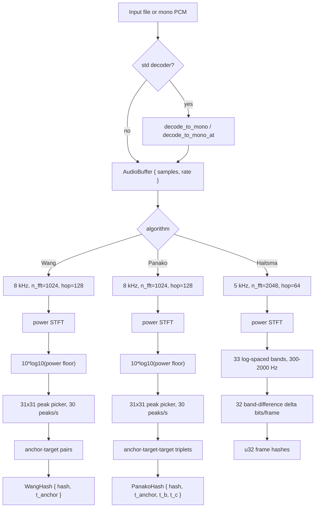
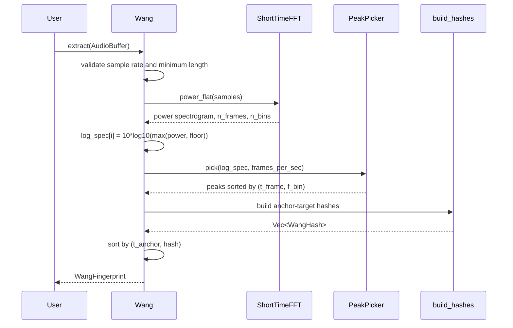
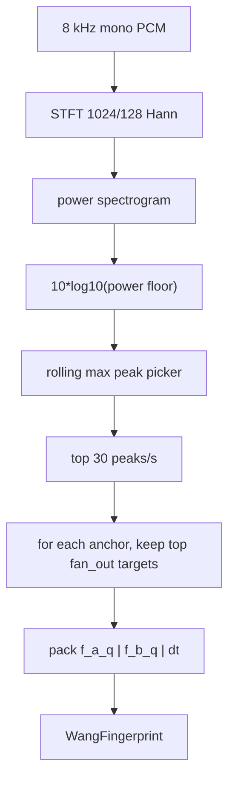
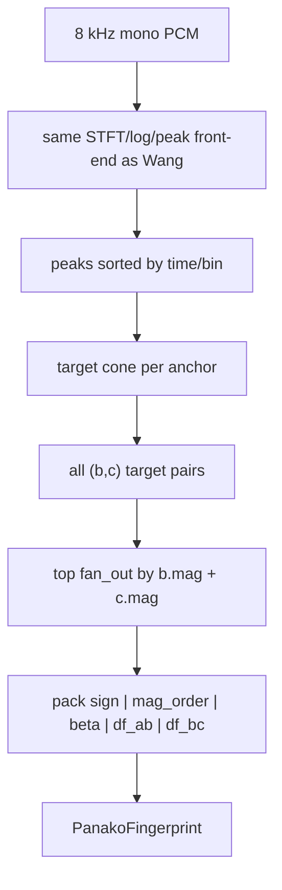
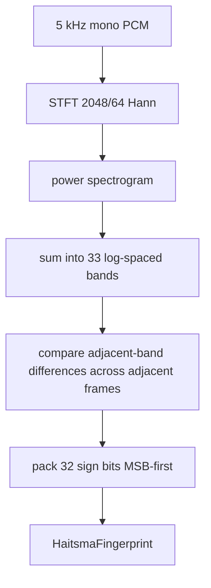

# audiofp - Internal Architecture & Algorithm Reference

> This document is the **internal** engineering reference for `audiofp`.
> It explains how audio moves through the DSP pipeline, how each
> fingerprinter packs bits, how streaming maintains offline parity, and how
> optional neural and watermark components are organized. For the user-facing
> SDK guide, see [USAGE.md](USAGE.md).

---

## Table of Contents

1. [Project Overview](#project-overview)
2. [Architecture](#architecture)
3. [Core Algorithms](#core-algorithms)
   - [Wang](#1-wang-landmark-pairs)
   - [Panako](#2-panako-triplets)
   - [Haitsma](#3-haitsma-kalker-band-power-hash)
   - [Streaming](#4-streaming-extraction)
   - [Neural Embedder](#5-neural-embedder)
   - [Watermark Detector](#6-watermark-detector)
4. [DSP Internals](#dsp-internals)
5. [Data Structures & Memory Layouts](#data-structures--memory-layouts)
6. [I/O and Resampling](#io-and-resampling)
7. [Edge Cases & Invariants](#edge-cases--invariants)
8. [Module Map](#module-map)

---

## Project Overview

**audiofp** is a Rust SDK (v0.3.1, edition 2024, MSRV 1.85) for extracting
deterministic fingerprints from mono PCM audio. It provides three classical
fingerprinters, streaming variants with offline parity, reusable DSP
primitives, optional ONNX log-mel embeddings, and optional AudioSeal-compatible
watermark detection.

It serves:

- Music identification and Shazam-style matching
- Audio deduplication across codec transcodes
- Rights enforcement and catalog matching
- Compact dense audio IDs
- Embedding-based similarity search with BYO ONNX models
- Watermark verification for generated or distributed audio

### Design Pillars

| Pillar | How |
|--------|-----|
| **Determinism** | Same input samples + same config -> same hashes. |
| **Stable hash bytes** | `WangHash`, `PanakoHash`, and `Peak` are `repr(C)` and `bytemuck::Pod`. |
| **Streaming parity** | Streaming output matches offline extraction under arbitrary chunking. |
| **DSP reuse** | STFT, peak picking, mel filters, windows, and resampling are public primitives. |
| **Feature isolation** | Classical DSP works in `no_std + alloc`; file I/O, neural, and watermark are feature-gated. |
| **Hot-path reuse** | FFT plans, peak-picker scratch, and streaming buffers are held on the extractor. |

---

## Architecture

### The Four-Stage Pipeline

Classical fingerprints flow through four stages:

```text
audio file or mono PCM
    |
    v
+-------------------------------------------------+
| Stage 1: Input                                  |
| optional Symphonia decode -> mono f32           |
+-------------------------------------------------+
    |
    v
+-------------------------------------------------+
| Stage 2: Sample-rate preparation                |
| caller or decode_to_mono_at resamples to target |
+-------------------------------------------------+
    |
    v
+-------------------------------------------------+
| Stage 3: DSP front-end                          |
| Hann STFT -> power/log spectrogram or bands     |
+-------------------------------------------------+
    |
    v
+-------------------------------------------------+
| Stage 4: Fingerprint                            |
| Wang pairs | Panako triplets | Haitsma frames   |
+-------------------------------------------------+
```

The crate accepts borrowed mono `f32` samples through `AudioBuffer`. File
decoding is optional and lives behind the default `std` feature.

### Classical Pipeline Diagram



### Runtime Sequence (Wang offline path)



### Feature Surface

| Feature | Default | Adds |
|---------|---------|------|
| `std` | Yes | `audiofp::io` Symphonia decoder |
| `neural` | No | ONNX log-mel embedder via Tract |
| `watermark` | No | AudioSeal-style detector via Tract |
| `mimalloc` | No | `mimalloc::MiMalloc` global allocator |

With default features disabled, the crate is `no_std + alloc` for DSP and
classical fingerprinters.

---

## Core Algorithms

### 1. Wang Landmark Pairs

#### Theory

Wang is a landmark-pair algorithm inspired by the Shazam paper. It finds stable
spectral peaks, treats each peak as an anchor, and pairs it with strong later
peaks in a bounded target zone.

#### Fixed Front-End

```text
sample rate:       8,000 Hz
n_fft:             1024
hop:               128
frame rate:        62.5 fps
window:            Hann
center framing:    false
frequency bins:    513
peak neighborhood: 15 frames x 15 bins each side, full 31x31 window
```

#### Default Config

```text
fan_out:            10
target_zone_t:      63 frames
target_zone_f:      64 FFT bins
peaks_per_sec:      30
min_anchor_mag_db: -50.0
```

#### Algorithm Walkthrough

```text
INPUT: mono f32 samples at 8 kHz, at least 16000 samples

Step 1 - STFT:
  power_flat(samples)
  n_bins = 513
  frames_per_sec = 8000 / 128 = 62.5

Step 2 - Log magnitude:
  log_spec[i] = 10 * log10(max(power[i], 1e-12))

Step 3 - Peak picking:
  rolling max over 31x31 neighborhood
  candidate if value > -50 dB and value >= local rolling max
  keep top 30 peaks per one-second bucket
  sort survivors by (t_frame, f_bin)

Step 4 - Landmark pairs:
  for each anchor peak:
    scan later peaks while 1 <= dt <= target_zone_t
    require abs(df) <= target_zone_f
    keep strongest fan_out targets by magnitude
    sort kept targets by magnitude desc, then position asc

Step 5 - Pack:
  f_a_q = floor(anchor_bin * 512 / 513)
  f_b_q = floor(target_bin * 512 / 513)
  dt = target_frame - anchor_frame
```

#### Hash Layout

```text
WangHash::hash (32 bits)

[31..23]  f_a_q  9 bits, anchor frequency bucket
[22..14]  f_b_q  9 bits, target frequency bucket
[13.. 0]  dt     14 bits, frame delta, minimum 1

WangHash (8 bytes, repr(C), Pod)
├── hash: u32
└── t_anchor: u32
```

#### Packing Formula

```text
hash =
    ((f_a_q & 0x1ff) << 23)
  | ((f_b_q & 0x1ff) << 14)
  | (dt & 0x3fff)
```

#### Wang Pipeline Diagram



#### Key Properties

- **Sparse landmarks**: output size depends on peaks and fan-out.
- **Codec tolerant**: strong spectral peaks tend to survive lossy encoders.
- **Time-local**: `t_anchor` enables offset voting in a matcher.
- **Stable ordering**: hashes sort by `(t_anchor, hash)` before returning.

---

### 2. Panako Triplets

#### Theory

Panako uses the same spectral front-end as Wang but emits triplet hashes. Each
anchor chooses two later target peaks. The packed hash includes a tempo ratio
`beta`, making the signature more tolerant of small time-scale changes.

#### Fixed Front-End

```text
sample rate:       8,000 Hz
n_fft:             1024
hop:               128
frame rate:        62.5 fps
window:            Hann
center framing:    false
frequency bins:    513
peak neighborhood: 31x31
```

#### Default Config

```text
fan_out:            5
target_zone_t:      96 frames, strict dt < 96
target_zone_f:      96 bins, strict abs(df) < 96
peaks_per_sec:      30
min_anchor_mag_db: -50.0
```

#### Algorithm Walkthrough

```text
INPUT: mono f32 samples at 8 kHz, at least 16000 samples

Step 1 - Shared front-end:
  power STFT -> dB log_spec -> peak picker

Step 2 - Collect target cone:
  for each anchor:
    collect later peaks where:
      1 <= dt < target_zone_t
      abs(df) < target_zone_f

Step 3 - Enumerate target pairs:
  for every ordered pair (b, c) from the target cone, b before c:
    score = b.mag + c.mag
    keep top fan_out triplets by score

Step 4 - Pack each triplet:
  df_ab = clamp(f_b - f_a, -127, 127)
  df_bc = clamp(f_c - f_b, -127, 127)
  sign = bit0(f_b >= f_a) | bit1(f_c >= f_b)
  mag_order = 0 if a largest, 1 if b largest, 2 if c largest
  beta = round((t_c - t_b) / (t_c - t_a) * 31), clamped 0..31
```

#### Hash Layout

```text
PanakoHash::hash (32 bits)

[31..30]  sign       2 bits, signs of df_ab and df_bc
[29..28]  mag_order  2 bits, strongest of a/b/c
[27..23]  beta       5 bits, relative timing ratio
[22..15]  df_ab      8 bits signed two's-complement
[14.. 7]  df_bc      8 bits signed two's-complement
[ 6.. 0]  reserved   7 bits, zero

PanakoHash (16 bytes, repr(C), Pod)
├── hash: u32
├── t_anchor: u32
├── t_b: u32
└── t_c: u32
```

#### Packing Formula

```text
hash =
    ((sign & 0x3) << 30)
  | ((mag_order & 0x3) << 28)
  | ((beta & 0x1f) << 23)
  | ((df_ab_u8 & 0xff) << 15)
  | ((df_bc_u8 & 0xff) << 7)
```

#### Panako Pipeline Diagram



#### Key Properties

- **Tempo-aware**: `beta` preserves relative target timing under mild tempo shifts.
- **Richer hash**: stores three frame positions for offset and stretch-aware matching.
- **Strict cone bounds**: Panako uses `< target_zone_t` and `< target_zone_f`, not `<=`.
- **Stable ordering**: hashes sort by `(t_anchor, t_b, t_c, hash)`.

---

### 3. Haitsma-Kalker Band-Power Hash

#### Theory

Haitsma-Kalker emits a dense 32-bit frame hash from spectral band energy
differences. It is compact and fast because it does not perform peak picking or
landmark pairing.

#### Fixed Front-End

```text
sample rate:     5,000 Hz
n_fft:           2048
hop:             64
frame rate:      78.125 fps
window:          Hann
center framing:  false
frequency bands: 33 log-spaced bands
default fmin:    300 Hz
default fmax:    2000 Hz
```

#### Algorithm Walkthrough

```text
INPUT: mono f32 samples at 5 kHz, at least 10000 samples

Step 1 - STFT:
  power_flat(samples) -> power[n_frame][bin]

Step 2 - Band energies:
  build 34 log-spaced edges from fmin to fmax
  map each FFT bin to one of 33 bands or None
  E[n][b] = sum power bins assigned to band b

Step 3 - Frame bits:
  for every frame n >= 1:
    for every band b in 0..32:
      lhs = E[n][b] - E[n][b+1]
      rhs = E[n-1][b] - E[n-1][b+1]
      bit[b] = (lhs - rhs) > 0

Step 4 - Pack:
  band 0 -> bit 31
  band 31 -> bit 0
```

#### Frame Layout

```text
Haitsma frame (u32)

bit 31  band 0
bit 30  band 1
...
bit  0  band 31
```

The output type is `HaitsmaFingerprint { frames: Vec<u32>, frames_per_sec:
f32 }`. Each frame is one 32-bit hash word.

#### Haitsma Pipeline Diagram



#### Key Properties

- **Dense**: roughly one 32-bit word per STFT frame from frame 1 onward.
- **Fast**: no 2-D peak picker, no target search.
- **Compact**: about 312 bytes/s at 78.125 fps.
- **Silence invariant**: all-zero input produces all-zero frame hashes.

---

### 4. Streaming Extraction

#### Goal

Every streaming implementation must emit the same hash sequence or multiset as
the corresponding offline `extract` call for the same total samples, regardless
of how input is chunked.

#### Streaming Wang and Panako

Wang and Panako need future context for peak picking and target zones, so they
defer emission until the relevant information has ripened.

```text
push(samples):
  append samples to sample_carry
  while sample_carry has a complete STFT frame:
    process one frame to power
    convert to dB log power
    append row to rolling spectrogram window
    when frame_idx >= peak_neighborhood:
      detect the row whose forward neighborhood is now available
  drain consumed hop samples
  finalize per-second peak buckets whose frames are fully detected
  emit anchors whose whole target zone has been finalized
```

Important state:

```text
sample_carry          leftover PCM below one full frame
spec                  rolling log-power spectrogram window
spec_first_frame      absolute frame index of row 0 in spec
n_frames_total        absolute frame counter
last_pd_frame         last peak-detected frame
bucket_pending        candidate peaks grouped by one-second bucket
last_finalized_bucket last bucket after top-N thresholding
pending_anchors       anchors waiting for full target-zone lookahead
```

Latency formulas:

```text
StreamingWang:
  (target_zone_t + 15 + ceil(62.5)) * 128 / 8000 seconds

StreamingPanako:
  (target_zone_t + 15 + ceil(62.5)) * 128 / 8000 seconds
```

Default values:

```text
Wang:   (63 + 15 + 63) * 128 / 8000 = 2256 ms
Panako: (96 + 15 + 63) * 128 / 8000 = 2784 ms
```

#### Streaming Haitsma

Haitsma is simpler because each output depends only on the current and previous
frame's band energies.

```text
push(samples):
  append samples to sample_carry
  while a full 2048-sample frame exists:
    process frame power
    sum power into 33 bands
    if a previous frame exists:
      pack_frame_bits(curr, prev)
      emit at absolute frame timestamp
    prev = curr
    advance by hop=64
  drain consumed samples
```

Latency:

```text
2048 samples / 5000 Hz = 409 ms
```

#### Streaming Neural

The neural streaming embedder buffers PCM until one complete analysis window is
available, runs the same `embed_window_into` routine as offline extraction, then
drains `hop_samples`.

```text
while sample_carry.len() >= window_samples:
  embed first window
  timestamp = samples_consumed * 1000 / sample_rate
  drain hop_samples
  samples_consumed += hop_samples
```

Partial windows do not emit on `flush`; non-centered framing means they cannot
produce a complete embedding.

---

### 5. Neural Embedder

#### Purpose

The `neural` feature provides a generic ONNX embedding path. The user supplies a
model whose first input accepts a log-mel spectrogram shaped
`[1, n_mels, n_frames]` and whose first output is an embedding vector.

#### Default Config

```text
sample_rate:   16000
n_fft:         1024
hop:           320
n_mels:        128
fmin:          0
fmax:          sample_rate / 2
mel_scale:     Slaney
window:        Hann
window_secs:   1.0
hop_secs:      1.0
l2_normalize:  true
```

#### Front-End

```text
window_samples = round(window_secs * sample_rate)
hop_samples    = round(hop_secs * sample_rate)
n_frames       = (window_samples - n_fft) / hop + 1

for each STFT frame:
  process_frame_power()
  MelFilterBank::log_mel_from_power()
  write into tensor position [0, mel, frame]
```

The tensor layout is `[1, n_mels, n_frames]`. The implementation writes
strided mel rows directly into the Tract tensor, avoiding an intermediate
transpose.

#### Model Lifecycle

```text
NeuralEmbedder::new(config):
  validate config
  load ONNX model
  set concrete input shape [1, n_mels, n_frames]
  type and optimize model
  build runnable plan
  run a zero probe to determine embedding_dim
  build LogMelFrontend
```

Extraction builds one embedding per analysis window, timestamps it at the
window start, and optionally L2-normalizes it.

#### Output Types

```text
NeuralEmbedding
├── vector: Vec<f32>
└── t_start: TimestampMs

NeuralFingerprint
├── embeddings: Vec<NeuralEmbedding>
├── embedding_dim: usize
└── frames_per_sec: f32 = 1.0 / hop_secs
```

---

### 6. Watermark Detector

#### Purpose

The `watermark` feature wraps AudioSeal-style ONNX detectors. It expects a model
that accepts `[1, 1, T]` waveform input and returns at least two outputs:
detection scores and message logits.

#### Config

```text
model_path:    String
message_bits:  16 by default, must be <= 32
threshold:     0.5 by default, must be in [0, 1]
sample_rate:   16000 by default
```

#### Detection Walkthrough

```text
INPUT: AudioBuffer at config.sample_rate, non-empty

Step 1 - Build input:
  Tensor shape [1, 1, samples.len()]

Step 2 - Concretize model:
  set input fact for this exact T
  type model
  build runnable

Step 3 - Run inference:
  outputs[0] = detection scores
  outputs[1] = message logits

Step 4 - Decode:
  localization = detection scores as Vec<f32>
  confidence = mean(localization), or 0.0 if empty
  detected = confidence > threshold
  message bit i = logits[i] >= 0, packed LSB-first
```

#### Output

```text
WatermarkResult
├── detected: bool
├── confidence: f32
├── message: u32
└── localization: Vec<f32>
```

---

## DSP Internals

### ShortTimeFFT

`ShortTimeFFT` owns:

```text
StftConfig
FFT plan: Arc<dyn RealToComplex<f32>>
window: Vec<f32>
scratch_in: Vec<f32>
scratch_out: Vec<Complex<f32>>
```

Config validation:

- `n_fft` must be non-zero and a power of two.
- `hop` must satisfy `0 < hop <= n_fft`.

Frame count:

```text
center=true:
  n_frames = 1 + n_samples / hop

center=false:
  if n_samples < n_fft: 0
  else: 1 + (n_samples - n_fft) / hop
```

Classical fingerprinters use `center=false` so frame 0 starts at sample 0 and
streaming can match offline exactly.

### Power vs Magnitude

Classical extractors use `power_flat` or `process_frame_power`:

```text
power = re^2 + im^2
```

Wang and Panako then compute:

```text
10 * log10(power)
```

This is equivalent to `20 * log10(sqrt(power))` and avoids a per-bin `sqrt`.

### PeakPicker

`PeakPicker` finds local maxima in a row-major spectrogram:

```text
candidate if:
  value > min_magnitude
  value >= rolling_max_2d(value's neighborhood)
```

The 2-D rolling max is separable:

1. run a 1-D monotonic-deque max over frequency for every row
2. run a 1-D monotonic-deque max over time for every column

This is amortized `O(n_frames * n_bins)` and independent of neighborhood size.

After local maximum selection, `adaptive_per_second` keeps only the top
`target_per_sec` peaks per one-second bucket.

### MelFilterBank

The mel filterbank owns a row-major matrix:

```text
matrix shape = (n_mels, n_fft / 2 + 1)
```

It supports HTK and Slaney scales. Filters are triangular and Slaney-normalized
to unit area in linear frequency.

Log-mel from power:

```text
out[mel] = log10(sum(matrix[mel, bin] * power[bin]) + 1e-10)
```

### Resampler

Two resamplers are provided:

```text
linear(input, from_sr, to_sr)
  cheap interpolation baseline

SincResampler
  windowed-sinc convolution
  Kaiser window
  default half_taps = 32
  default beta = 8.6
  cutoff = min(from_sr, to_sr) / from_sr / 2
```

`decode_to_mono_at` uses `SincResampler::new` when the decoded file sample rate
does not match the requested target rate.

---

## Data Structures & Memory Layouts

### Shared Value Types

```text
SampleRate(NonZeroU32)
AudioBuffer<'a> { samples: &'a [f32], rate: SampleRate }
TimestampMs(u64)
```

`AudioBuffer` is a borrowed mono PCM view. It does not validate sample range;
downstream code clips or interprets samples as needed.

### Peak

```text
Peak - repr(C), bytemuck::Pod, 12 bytes

+---------------+---------+
| field         | size    |
+---------------+---------+
| t_frame: u32  | 4 bytes |
| f_bin: u16    | 2 bytes |
| _pad: u16     | 2 bytes |
| mag: f32      | 4 bytes |
+---------------+---------+
```

The explicit `_pad` field prevents implicit padding and keeps the layout
stable for `Pod`.

### WangHash

```text
WangHash - repr(C), bytemuck::Pod, 8 bytes

+---------------+---------+
| field         | size    |
+---------------+---------+
| hash: u32     | 4 bytes |
| t_anchor: u32 | 4 bytes |
+---------------+---------+
```

### PanakoHash

```text
PanakoHash - repr(C), bytemuck::Pod, 16 bytes

+---------------+---------+
| field         | size    |
+---------------+---------+
| hash: u32     | 4 bytes |
| t_anchor: u32 | 4 bytes |
| t_b: u32      | 4 bytes |
| t_c: u32      | 4 bytes |
+---------------+---------+
```

### Fingerprint Containers

```text
WangFingerprint
├── hashes: Vec<WangHash>
└── frames_per_sec: f32

PanakoFingerprint
├── hashes: Vec<PanakoHash>
└── frames_per_sec: f32

HaitsmaFingerprint
├── frames: Vec<u32>
└── frames_per_sec: f32
```

Container structs are not `Pod` because they own `Vec`s. The individual hash
rows are `Pod` and can be byte-cast for persistence.

---

## I/O and Resampling

### Decoder

The `std` feature enables Symphonia-backed helpers:

```text
decode_to_mono(path) -> Result<(Vec<f32>, u32)>
decode_to_mono_at(path, target_sr) -> Result<Vec<f32>>
```

Supported formats follow the enabled Symphonia features:

- MP3
- FLAC
- WAV
- OGG/Vorbis
- AAC in MP4
- raw PCM

### Downmixing

Decoded multi-channel audio is downmixed by averaging channels per frame:

```text
mono[i] = sum(channel[c][i]) / channel_count
```

### Recoverable Decode Errors

Recoverable per-packet `IoError` and `DecodeError` values from Symphonia are
skipped. Fatal probe, packet, decoder construction, and unrecoverable decode
errors become `AfpError::Io`.

### Sample-Rate Contract

Classical extractors are sample-rate strict:

```text
Wang:    8000 Hz
Panako:  8000 Hz
Haitsma: 5000 Hz
```

Use `decode_to_mono_at` or `SincResampler` before calling `extract` if source
audio is at a different rate.

---

## Edge Cases & Invariants

### Input Invariants

- Classical APIs require mono `f32` input.
- Wrong sample rates return `AfpError::UnsupportedSampleRate`.
- Inputs shorter than `min_samples()` return `AfpError::AudioTooShort`.
- Wang and Panako require at least 2 seconds at 8 kHz.
- Haitsma requires at least 2 seconds at 5 kHz.
- Silence is valid input: Wang/Panako emit empty hashes; Haitsma emits zero frames.

### STFT Invariants

- `n_fft` must be a power of two.
- `hop` must be in `(0, n_fft]`.
- Classical algorithms use `center=false`.
- `n_bins = n_fft / 2 + 1`.
- Streaming frame timestamps use `frame_index * hop * 1000 / sample_rate`.

### Wang Invariants

- Frequency bins are quantized from 513 bins to 512 buckets.
- Pair `dt` is at least 1.
- Pair target zone uses `dt <= target_zone_t` and `abs(df) <= target_zone_f`.
- Output is sorted by `(t_anchor, hash)`.
- Algorithm name is `"wang-v1"`.

### Panako Invariants

- Target cone uses strict bounds: `dt < target_zone_t`, `abs(df) < target_zone_f`.
- `df_ab` and `df_bc` are clamped to signed 8-bit range.
- `beta` is clamped to 0..31.
- Low 7 bits of the packed hash are reserved zero.
- Output is sorted by `(t_anchor, t_b, t_c, hash)`.
- Algorithm name is `"panako-v2"`.

### Haitsma Invariants

- Band range must satisfy `fmin > 0`, `fmax > fmin`, and `fmax < sample_rate / 2`.
- There are 33 band energies and 32 output bits per frame.
- Band 0 maps to bit 31; band 31 maps to bit 0.
- Frame 0 has no output hash because it has no previous frame.
- Algorithm name is `"haitsma-v1"`.

### Streaming Invariants

- Streaming output matches offline output for the same complete input.
- `push` work is proportional to new complete frames/windows, not the total stream length.
- `flush` drains pending complete work.
- Partial Haitsma and neural windows do not emit.
- Streaming Wang/Panako flush finalizes remaining buckets and anchors.

### Neural Invariants

- `sample_rate > 0`.
- `n_fft` is a power of two and at least 2.
- `0 < hop <= n_fft`.
- `n_mels > 0`.
- `0 <= fmin < fmax <= sample_rate / 2`.
- `window_samples >= n_fft`.
- `0 < hop_samples <= window_samples`.
- Model input is concretized as `[1, n_mels, n_frames]`.

### Watermark Invariants

- `message_bits <= 32`.
- `threshold` is in `[0, 1]`.
- Input sample rate must match `WatermarkConfig::sample_rate`.
- Empty input is rejected.
- Message bits are packed LSB-first into `u32`.

---

## Module Map

```text
src/
├── lib.rs                    # crate docs, feature gates, re-exports, VERSION
├── error.rs                  # AfpError, Result
├── types.rs                  # SampleRate, AudioBuffer, TimestampMs
├── fp.rs                     # Fingerprinter, StreamingFingerprinter traits
├── classical/
│   ├── mod.rs                # re-exports and algorithm overview
│   ├── wang.rs               # Wang offline and streaming implementations
│   ├── panako.rs             # Panako offline and streaming implementations
│   └── haitsma.rs            # Haitsma offline and streaming implementations
├── dsp/
│   ├── mod.rs                # DSP module exports
│   ├── stft.rs               # ShortTimeFFT, StftConfig
│   ├── peaks.rs              # PeakPicker, Peak, rolling max
│   ├── resample.rs           # linear and sinc resamplers
│   ├── mel.rs                # MelFilterBank, MelScale
│   └── windows.rs            # Hann and other window functions
├── io/
│   ├── mod.rs
│   └── decoder.rs            # Symphonia decode_to_mono helpers
├── neural/
│   ├── mod.rs
│   ├── frontend.rs           # LogMelFrontend
│   ├── embedder.rs           # NeuralEmbedder, config, output types
│   ├── streaming.rs          # StreamingNeuralEmbedder
│   └── test_support.rs       # ONNX fixture helpers for tests
└── watermark/
    ├── mod.rs
    └── detector.rs           # WatermarkDetector, config, result
```

### Public API Surface

```text
audiofp
├── VERSION
├── AfpError / Result
├── AudioBuffer / SampleRate / TimestampMs
├── Fingerprinter / StreamingFingerprinter
├── classical::{Wang, Panako, Haitsma}
├── classical::{StreamingWang, StreamingPanako, StreamingHaitsma}
├── dsp::{stft, peaks, resample, mel, windows}
├── io::{decode_to_mono, decode_to_mono_at}              # std
├── neural::{NeuralEmbedder, StreamingNeuralEmbedder}    # neural
└── watermark::{WatermarkDetector, WatermarkConfig}      # watermark
```

---

## End-to-End Example Trace

```text
Input:
  "song.mp3"

Decode:
  decode_to_mono_at("song.mp3", 8000)
  Symphonia probes and decodes packets
  channels are averaged to mono
  SincResampler converts native rate to 8000 Hz if needed

Fingerprint:
  Wang::extract(AudioBuffer { samples, rate: HZ_8000 })
  validate rate and length
  STFT power spectrogram with n_fft=1024, hop=128
  convert power to dB log magnitude
  pick spectral peaks with 31x31 rolling max
  keep top 30 peaks per second
  build anchor-target landmark pairs
  pack 32-bit Wang hashes
  sort output deterministically

Output:
  WangFingerprint {
    hashes: Vec<WangHash>,
    frames_per_sec: 62.5,
  }
```

---

## Practical Tuning Notes

### Pick the Algorithm by Storage and Robustness

| Algorithm | Best fit |
|-----------|----------|
| Wang | General music ID and offset voting |
| Panako | Matching with mild tempo/time-scale changes |
| Haitsma | Compact dense fingerprints and fast extraction |
| Neural | Semantic similarity, cover/remix search, learned embeddings |
| Watermark | Detecting model-specific embedded marks |

### Keep Sample Rates Explicit

Classical extractors intentionally do not resample internally. That keeps hash
bytes stable and avoids hidden quality tradeoffs. Use:

```rust
use audiofp::io::decode_to_mono_at;

let wang_ready = decode_to_mono_at("song.flac", 8_000)?;
let haitsma_ready = decode_to_mono_at("song.flac", 5_000)?;
# Ok::<_, audiofp::AfpError>(())
```

### Persist Algorithm Names Beside Bytes

When storing hashes, persist `Fingerprinter::name()` with the bytes:

```text
wang-v1
panako-v2
haitsma-v1
neural-onnx-v0
```

The version suffix is the semantic compatibility boundary for hash bytes.

